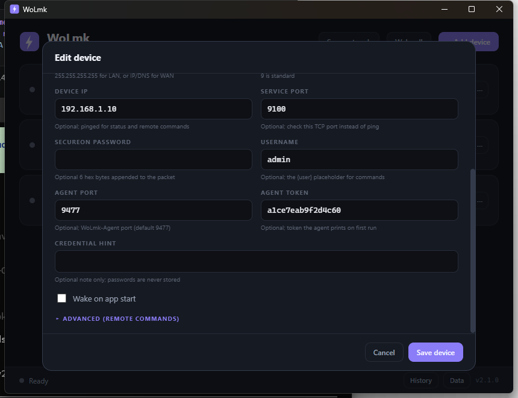
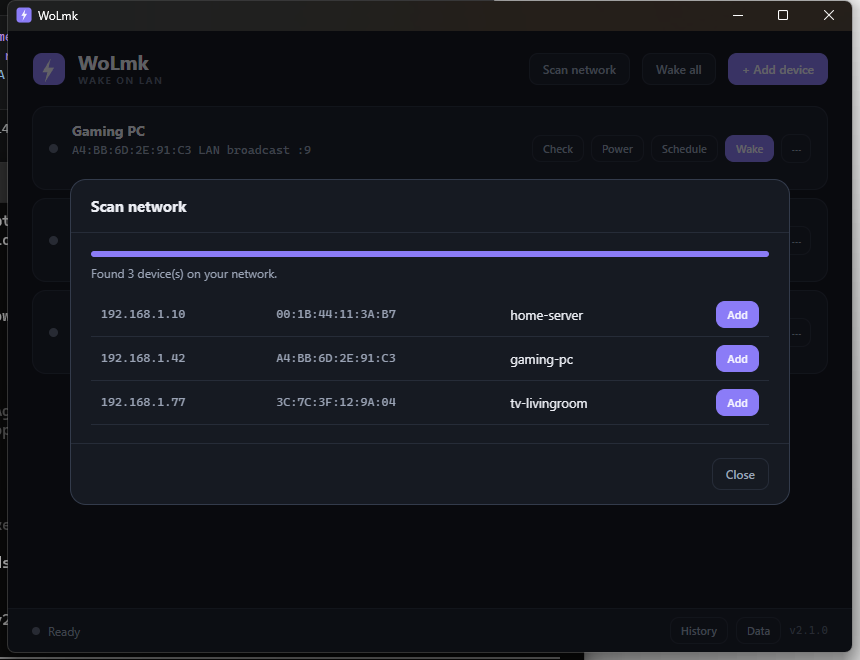

<p align="center">
  
</p>

<p align="center">
  <a href="https://github.com/MhmdMK277/WoLbyMK/releases"></a>
  <a href="LICENSE"></a>
  
  
  
</p>

<p align="center">
  A fast, single binary Wake-on-LAN desktop app. Add your devices once, then wake them, watch them come online, schedule wakes, scan your network, and send remote power commands, all from a clean dark interface or a browser.
</p>

---

## Features

- Device manager: name, MAC, broadcast host, port, optional device IP, service port, SecureOn password, username, credential hint and companion agent credentials. Configs persist between launches.
- LAN wake over UDP broadcast, and WAN wake to a public IP or a DNS name that is resolved before sending.
- Repeat wake: each wake sends a configurable number of magic packets a short interval apart.
- Live status checks: after a wake, WoLmk pings the device and shows the result on the card (waiting, online with round-trip time, or unreachable). A Check button runs a single probe on demand.
- Custom TCP port checks: set a service port and status checks use a TCP connect to that port instead of ICMP.
- SecureOn password: optional 6 hex byte password appended to the magic packet.
- Remote power: Shutdown, Reboot, Sleep and Lock from the card Power menu. Uses the companion agent when configured, or falls back to editable command templates for shutdown and sleep.
- Companion agent: a lightweight service (WoLmk-Agent) that runs on a target machine and executes power commands over an authenticated connection. See below.
- Network scanner: sweep your subnet to discover devices, then add them with one click.
- Web server mode: serve a browser control panel and a REST API that share the same devices.
- Scheduled wake: repeating (weekdays and time) or one-time (date and time). A background loop runs every 30 seconds, schedules survive restarts, and a clock icon marks scheduled devices.
- Wake all with a staggered delay between devices and live progress.
- Auto-wake on launch, wake history, and import/export through native file dialogs.
- System tray, keyboard shortcuts (Ctrl+N add, Ctrl+W wake selected, Ctrl+A wake all, Escape close dialogs), and a CLI mode.
- Cross-platform: Windows, macOS and Linux, with per-OS ping and command detection.

## Screenshots


*The devices, MAC addresses, IPs and hostnames shown are fictional sample data, not real values.*



*Example placeholder values, including the companion agent fields. Enter your own device details here.*



*Discovered devices shown are fictional sample data.*


*Fictional sample schedule.*


*History entries shown are fictional sample data.*

## Download

Grab the latest `WoLmk.exe` (desktop app) and `WoLmk-Agent.exe` (companion service) for Windows from the [Releases](https://github.com/MhmdMK277/WoLbyMK/releases) page. No installer or runtime is required. macOS and Linux users can build from source (see below).

Configuration lives in the OS application data directory:

| Platform | Location |
|----------|----------|
| Windows | `%APPDATA%\WoLmk\` |
| macOS | `~/Library/Application Support/wolmk/` |
| Linux | `~/.config/wolmk/` |

It holds `devices.json` (devices and schedules), `history.json` (wake log) and optionally `settings.json`.

## Getting started

1. Launch WoLmk and click **+ Add device**, or use **Scan network** to discover devices and add them with one click.
2. Enter a name and the target's MAC address. Leave the host as `255.255.255.255` for a normal LAN wake, or enter a public IP or DDNS hostname for WAN wake.
3. Optionally set a **Device IP** so WoLmk can ping the machine and report when it comes online, or a **Service port** to check a TCP port instead.
4. Click **Wake**. The status line and LED update as the device responds.

For the target to wake, enable Wake-on-LAN in its BIOS/UEFI and network adapter power settings, and use a wired connection where possible.

## Companion agent

Wake-on-LAN only powers a machine on. To shut it down, reboot, sleep or lock it remotely, run the **WoLmk-Agent** on that machine. The agent listens on a TCP port and executes power commands that are authenticated with a token.

### Set up

1. Copy `WoLmk-Agent.exe` to the target machine and run it. On first run it prints its hostname, IP, MAC, listening port and a generated auth token, and keeps running in the system tray.
2. In the WoLmk desktop app, edit that device and fill in **Agent port** (default 9477) and **Agent token** with the values the agent printed.
3. Use the card **Power** menu (Shutdown, Reboot, Sleep, Lock). When agent credentials are set, WoLmk sends the action to the agent; otherwise it falls back to the command templates in the Advanced section for shutdown and sleep.

### Run as a Windows service

To keep the agent running in the background across reboots:

```bash
WoLmk-Agent.exe --install     # register and start the service (run as Administrator)
WoLmk-Agent.exe --uninstall   # remove the service
```

### Protocol

The agent accepts a single JSON request per TCP connection and replies with JSON:

```json
Request:  { "action": "shutdown", "token": "your-token" }
Response: { "status": "ok" }
Response: { "status": "error", "message": "unauthorized" }
```

Valid actions are `shutdown`, `reboot`, `sleep`, `lock` and `ping`. The token is stored in the agent config file and never leaves the machines you control. Commands map to native calls per platform (for example `shutdown /s /t 0` on Windows, `systemctl poweroff` on Linux, and an `osascript` shutdown on macOS).

## Network scanner

Click **Scan network** to sweep the local `/24` subnet. WoLmk pings each host, reads the ARP cache for MAC addresses, and does a reverse DNS lookup for hostnames. Discovered devices appear in a list with an **Add** button that pre-fills the add device dialog.

## Web server mode

Run WoLmk as a headless web server to control your devices from any browser on the network:

```bash
WoLmk.exe --serve [port]      # default port 8080
```

On startup it prints the local and network URLs. The web UI uses the same dark theme and shares `devices.json` with the desktop app.

### REST API

| Method | Endpoint | Description |
|--------|----------|-------------|
| GET | `/api/devices` | List all devices |
| POST | `/api/wake/{id}` | Wake a device |
| POST | `/api/shutdown/{id}` | Shut down a device |
| POST | `/api/reboot/{id}` | Reboot a device |
| POST | `/api/sleep/{id}` | Sleep a device |
| POST | `/api/lock/{id}` | Lock a device |
| GET | `/api/status/{id}` | Ping or port check a device |

`{id}` is the zero-based index of the device in the list. Power endpoints use the companion agent when configured.

### settings.json

All keys are optional; defaults shown:

```json
{
  "watchTimeout": 60,
  "watchInterval": 2,
  "sendCount": 3,
  "sendInterval": 500,
  "stagger": 2
}
```

- `watchTimeout`, `watchInterval`: how long (seconds) and how often to ping after a wake.
- `sendCount`, `sendInterval`: packets per wake and the gap between them (milliseconds).
- `stagger`: seconds between devices when using Wake all.

## Building from source

WoLmk is a [Wails](https://wails.io) app: a Go backend with an HTML, CSS and JavaScript frontend. The agent is a plain Go binary.

Prerequisites:

- Go 1.24 or newer
- Node.js and npm (for the frontend build)
- The Wails CLI

```bash
# install the Wails CLI
go install github.com/wailsapp/wails/v2/cmd/wails@latest

# from the repository root
wails build                         # builds build/bin/WoLmk.exe
go build -o build/bin/WoLmk-Agent.exe ./cmd/agent
```

For live development of the desktop app use `wails dev`.

## CLI usage

WoLmk can send a magic packet without opening the window, which is handy for Task Scheduler, cron or scripts:

```bash
WoLmk.exe --send AA:BB:CC:DD:EE:FF [host] [port]
```

- `host` defaults to `255.255.255.255`
- `port` defaults to `9`

The command exits with code 0 on success and 1 on error.

## History

WoLmk started as a Python and Tkinter app. Version 2.0.0 was a full rewrite in Go and Wails. Version 2.1.0 adds the companion agent, network scanner, web server with REST API, DDNS resolution, and reboot and lock actions. The original Python edition is preserved in the repository history.

## License

[MIT](LICENSE)
