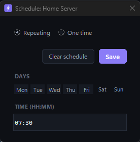

# WoLmk

A standalone Wake-on-LAN desktop app for Windows. Add your devices once, then wake them with a single click, either on your local network or over the internet. WoLmk also confirms a device came online, runs on a schedule, and can send remote power commands to machines you manage.


*The devices, MAC addresses, IPs and hostnames shown are fictional sample data, not real values.*

## Features

- Device manager: save name, MAC address, host, port and optional details. Configs persist between launches.
- LAN wake: broadcast magic packets on your local network (default `255.255.255.255:9`).
- WAN wake: target a public IP or DNS name and forwarded port to wake machines remotely.
- Live status checks: after a wake, WoLmk pings the device and shows the result on the card (waiting, online with round-trip time, or unreachable). A Check button runs a single probe on demand.
- Custom port checks: set a Service port and status checks use a TCP connect to that port instead of ICMP, shown as "Online (port 9100), 3 ms".
- Repeat wake: each wake sends several packets a short interval apart for reliability (configurable).
- SecureOn password: optional 6 hex byte password appended to the magic packet for NICs that require it.
- Remote power commands: optional Shutdown and Sleep buttons per device. Defaults use Windows PowerShell remoting; power users can set any command (SSH, custom scripts) in the Advanced section.
- Scheduled wake: give a device a repeating (days plus time) or one-time (date plus time) schedule. Schedules run in the background and survive restarts. A clock icon marks scheduled devices.
- System tray mode: closing the window minimizes to the tray (Show, Wake all, Exit).
- Wake history: every attempt is logged and viewable from the History button (last 50 entries).
- Import and export devices from the Data menu in the footer.
- Auto-wake on launch: mark a device "Wake on app start" to wake it whenever WoLmk opens.
- Keyboard shortcuts, see below.
- Single portable `.exe`, no runtime required.
- CLI mode: `wolmk.exe --send AA:BB:CC:DD:EE:FF [host] [port]` for use in scripts.


*Example placeholder values; enter your own device details here.*



*Fictional sample schedule.*


*History entries shown are fictional sample data.*

## Keyboard shortcuts

| Shortcut | Action |
|----------|--------|
| Ctrl+N | Add device |
| Ctrl+W or Enter | Wake the selected device (click a card to select it) |
| Ctrl+A | Wake all devices |
| Escape | Close the history overlay or a dialog |

## Remote shutdown and sleep

Each device can send a remote power command. The defaults target Windows machines over PowerShell remoting:

- Shutdown: `powershell -Command "Stop-Computer -ComputerName {ip} -Force"`
- Sleep: `powershell -Command "Invoke-Command -ComputerName {ip} -ScriptBlock { rundll32.exe powrprof.dll,SetSuspendState 0,1,0 }"`

The `{ip}` placeholder is filled from the device IP (or host), and `{user}` from the Username field. Passwords are never stored: WoLmk only keeps the username and an optional free-text credential hint. For authenticated targets, either rely on integrated Windows authentication or edit the command in the Advanced section to prompt at send time, for example by adding `-Credential (Get-Credential {user})`. You can also replace the command entirely with an SSH call or any other tool. PowerShell remoting must be enabled on the target (`Enable-PSRemoting`) and the account must have rights to shut it down.

## Scheduled wake

Open Schedule on a device to set either a repeating schedule (pick weekdays and a time) or a one-time wake (a date and time). A background loop checks every 30 seconds and fires the wake at the set time. Schedules are stored in `devices.json`, so they survive restarts. A one-time schedule marks itself fired after it runs. The app must be running (including minimized to the tray) for a schedule to fire; pair it with Windows Task Scheduler or the "Wake on app start" option if you want it to run unattended.

## Download and run

Download the latest `WoLmk.exe` from [Releases](../../releases) and run it.

Data is stored in `%APPDATA%\WoLmk\`: `devices.json` (your devices and schedules), `history.json` (wake log) and optionally `settings.json`.

### settings.json

All keys are optional; defaults shown:

```json
{
  "watch_timeout": 60,
  "watch_interval": 2,
  "send_count": 3,
  "send_interval": 500,
  "stagger": 2
}
```

- `watch_timeout`, `watch_interval`: how long (seconds) and how often to ping after a wake.
- `send_count`, `send_interval`: how many magic packets to send per wake and the gap between them (milliseconds).
- `stagger`: seconds to wait between devices when using Wake all.

## Run from source

```bash
python wolmk.py
```

Requires Python 3.9 or newer. Core functionality has no dependencies. Installing `pystray` and `pillow` enables the system tray mode; without them the app simply closes normally.

## Build the .exe yourself

```bash
build.bat
```

This installs PyInstaller if needed and produces `dist\WoLmk.exe` as a single file.

## How Wake-on-LAN works

Wake-on-LAN wakes a sleeping or powered-off machine by sending a magic packet: a UDP datagram containing 6 bytes of `0xFF` followed by the target's MAC address repeated 16 times (102 bytes total). An optional SecureOn password adds 6 more bytes. The network card stays powered in low-power states, watches for this pattern, and signals the motherboard to boot.

For it to work, the target machine needs:

1. BIOS/UEFI: enable Wake on LAN (sometimes called "Power On by PCI-E").
2. Windows: Device Manager, network adapter, Power Management tab, enable "Allow this device to wake the computer". Disable Fast Startup if you want wake-from-shutdown.
3. A wired connection. WOL over Wi-Fi (WoWLAN) is rarely supported and unreliable.

### Waking over the internet (WAN)

Magic packets are broadcast-based and do not route across the internet by themselves. To wake a machine remotely:

1. On your router, forward an external UDP port (for example `9`) to your LAN's broadcast address (for example `192.168.1.255`), or to the target's static IP with a static ARP entry.
2. In WoLmk, set the device's host to your public IP or DDNS hostname and the port to the forwarded port.
3. Click Wake.

## Platform notes

The GUI and wake work on Windows, Linux and macOS from source; status-check ping flags are selected per platform. Remote power command defaults assume Windows targets, but the command is fully editable per device. Prebuilt binaries are provided for Windows only.

## License

[MIT](LICENSE)
