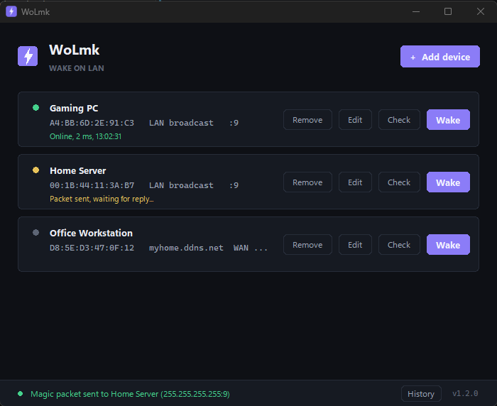
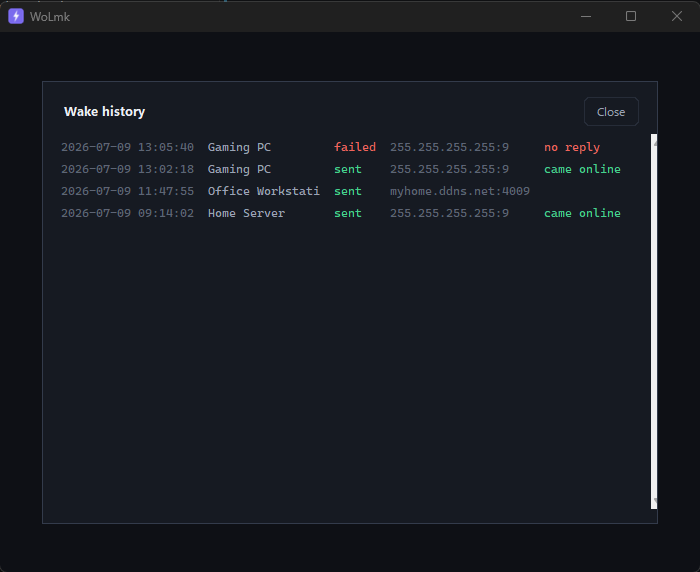
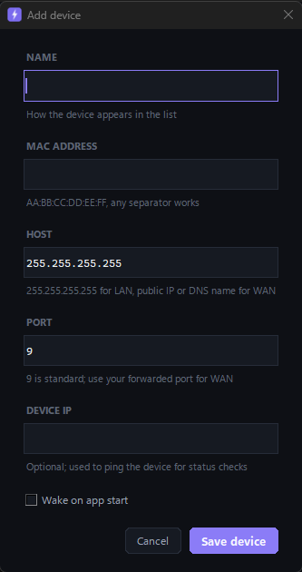

# WoLmk

A standalone Wake-on-LAN desktop app for Windows. Add your devices once, then wake them with a single click, either on your local network or over the internet.



*The devices, MAC addresses, IPs and hostnames shown are fictional sample data, not real values.*

## Features

- Device manager: save name, MAC address, host, port and an optional device IP. Configs persist between launches.
- LAN wake: broadcast magic packets on your local network (default `255.255.255.255:9`).
- WAN wake: target a public IP or DNS name and forwarded port to wake machines remotely.
- Live status checks: after a wake, the app pings the device every 2 seconds for up to 60 seconds and shows the result on the card (waiting, online with round-trip time, or unreachable). A Check button runs a single ping on demand.
- System tray mode: closing the window minimizes to the tray. The tray menu offers Show, Wake all and Exit.
- Wake history: every attempt is logged with timestamp, target and outcome. The History button in the footer shows the last 50 entries.



*History entries shown are fictional sample data.*

- Auto-wake on launch: mark a device "Wake on app start" and WoLmk wakes it every time the app opens. Pairs well with Windows Task Scheduler.
- Keyboard shortcuts, see below.
- Single portable `.exe`, no runtime required.
- CLI mode: `wolmk.exe --send AA:BB:CC:DD:EE:FF [host] [port]` for use in scripts.



*Example placeholder values; enter your own device details here.*

## Keyboard shortcuts

| Shortcut | Action |
|----------|--------|
| Ctrl+N | Add device |
| Ctrl+W or Enter | Wake the selected device (click a card to select it) |
| Ctrl+A | Wake all devices |
| Escape | Close the history overlay or a dialog |

## Download and run

Download the latest `WoLmk.exe` from [Releases](../../releases) and run it.

Data is stored in `%APPDATA%\WoLmk\`: `devices.json` (your devices), `history.json` (wake log) and optionally `settings.json`. To change the post-wake watch behavior, create `settings.json` with:

```json
{ "watch_timeout": 60, "watch_interval": 2 }
```

## Run from source

```bash
python wolmk.py
```

Requires Python 3.9 or newer. Core functionality has no dependencies. Installing `pystray` and `pillow` enables the system tray mode; without them the app simply closes normally.

## Build the .exe yourself

```bash
build.bat
```

This installs PyInstaller if needed and produces `dist\WoLmk.exe` as a single file.

## How Wake-on-LAN works

Wake-on-LAN wakes a sleeping or powered-off machine by sending a magic packet: a UDP datagram containing 6 bytes of `0xFF` followed by the target's MAC address repeated 16 times (102 bytes total). The network card stays powered in low-power states, watches for this pattern, and signals the motherboard to boot.

For it to work, the target machine needs:

1. BIOS/UEFI: enable Wake on LAN (sometimes called "Power On by PCI-E").
2. Windows: Device Manager, network adapter, Power Management tab, enable "Allow this device to wake the computer". Disable Fast Startup if you want wake-from-shutdown.
3. A wired connection. WOL over Wi-Fi (WoWLAN) is rarely supported and unreliable.

### Waking over the internet (WAN)

Magic packets are broadcast-based and do not route across the internet by themselves. To wake a machine remotely:

1. On your router, forward an external UDP port (for example `9`) to your LAN's broadcast address (for example `192.168.1.255`), or to the target's static IP with a static ARP entry.
2. In WoLmk, set the device's host to your public IP or DDNS hostname and the port to the forwarded port.
3. Click Wake.

## License

[MIT](LICENSE)
